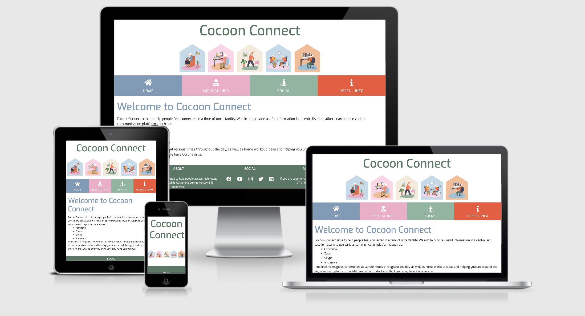
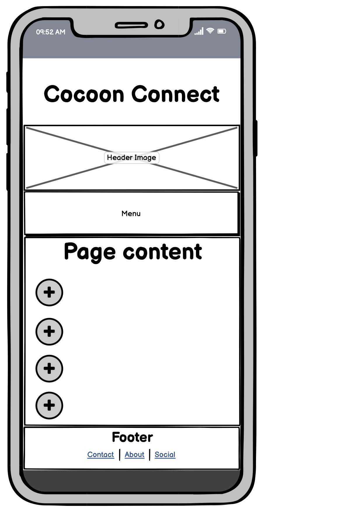
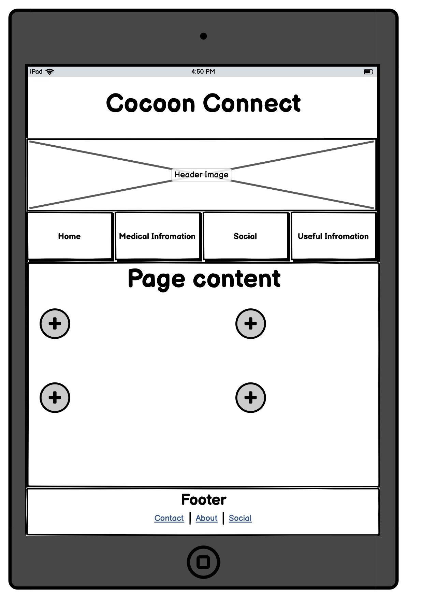
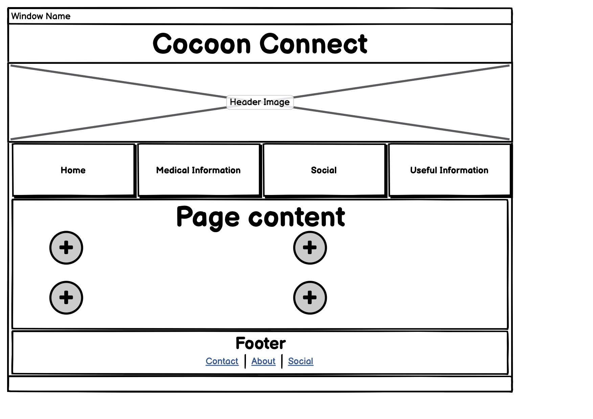

<h1 align="center">Cocoon Connect Website</h1>

[View the live project here.](https://annaoflynn.github.io/cocoon_connect/)

This is an informative website for senior member of the community Cocooning during the Covid-19 pandemic. It is designed to be responsible and accessible on a range of devices, making it easy and intuitive to navigate for even for individuals who may not have a high level of computer literacy.

<h2 align="center"></h2>

## **User Experience (UX)**

### **Project Goals**

The goal for this project is to provide an easy to navigate platform that caters specifically for older users who may have lower computer literacy. Helping individuals who may be new to technology to stay connected with loved one through its useful video tutorials and links to useful platforms and information. 

 
### **User stories**

#### **First Time Visitor Goals**

1. As a First Time Visitor, I want to easily understand the main purpose of the site and learn more about the signs and symptoms of Covid-19, what to do if you suspect you may have covid, as well to create awareness of the various platforms and organization to enable you to stay connected with family and friend and how to use them.
2. As a First Time Visitor, I want to be able to easily navigate throughout the site to find relevant content.
3. As a First Time Visitor, I want to look for information on how to use communication platform and have a central location where I can access many platforms to help me to in contact with family and friends during these strange times..

#### **Returning Visitor Goals**

1. As a Returning Visitor, I want to find links to have a central location where I can access a number of different platforms, links to different masses at a number of different time
2. As a Returning Visitor, to find information on the signs and symptoms of Covid-19 and what to do if I suspect I may have covid. 
3. As a Returning Visitor, I want to find links to community groups and organizations that can help combat loneliness during these difficult times  .

#### **Frequent User Goals**
1. As a Frequent User, I want to have a central location to access communication platforms
2. As a Frequent User,I want to find links to entertainment platforms.

#### **Site Owner  Goals**
As a site owner I want to
1. Make it easy for older users to access relevant information in a centralized location.
2. I want a visually appealing yet easy to navigate website, so my target demographic finds it easy to use.
3. I want to help inform people how technology can help them stay connected to friends and family during this weird time.

 ### **User Requirements and Expectations**

#### **Requirements**
- To navigate the website using the navbar easily and quickly.
- To be provided with useful information on covid-19 and other information of interest.
- Content displayed in an easy to read and clear manner.
- Information displayed in a concise manner that is easy to digest.
- Easy access to information without having to go to multiple websites and read vast amounts of information

#### **Expectations**
- Content is quick to locate and easy to read.
- Navigation is simple to use and intuitive even to those who are not overly tech literate.
- All external links open in a separate tab so they can easily get back to the original site.
- All external links open to the relevant part of the site rather than the home page

### **Design**
#### **Colour Scheme**
When designing this site, I researched how best to design for an older demographic. I wanted to ensure that the website was intuitive to use easy to navigate, had clear text, with good contrast and large clickable areas for ease of use for individuals with reduced dexterity, while still being visually appealing.
This is most evident in the responsive navbar which maintains a full width clickable area for all screen sizes. With the expanded menu present in large and medium screen sizes and a collapsible button with “menu” text as opposed to a burger icon to ensure the purpose of it is clear even to those that are not overly computer literate.
I loosely based my website design off the CV project from the course material and adapted it to better suit my target demographic and suit the aesthetic I was trying to achieve.

 #### **Colour Scheme**
The colors I used were inspired by the header image which I found in the Shutterstock library
I used a colour picker tool to get the hex values for the colours from the image. 
- For the Website title, footer and menu button, in mobile view I used #547864
- For the home page titles and nav button I used #7B9AB9
- For the medical Info nav button, page titles and icons I used #F4ABC7
- For the social page nav button, and all associated page’s titles and icons I used #8AB69E
- For useful contacts and resources, nav button, titles and icons I used #F25637

#### **Typography**
- The Exo font is the main font used throughout the whole website with Sans Serif as the fallback font in case for any reason the font isn't being imported into the site correctly. Exo is a clean font as it is both attractive and appropriate. The font is easy to read and the colors used in the typography ensure a high contrast between the font and the background color which is an important feature when developing a site for more senior web users. 
#### **Imagery**
-  Imagery is important. The large, background header image is designed to be striking and catch the user's attention. It also has a modern, energetic and relevant aesthetic.

#### **Icons**
- I used Icons form Font Awesome add a visual representation of text. I used sparingly and only where appropriate and where I felt they would add value. I struggled to find some appropriate font awesome icons that were appropriate and work in with the version of font awesome that I was using. This is most noticeable on the medical info page as I couldn’t find an icon to represent a sore throat and ended up having to reuse the tissue box.

### **Wireframes**

-   Mobile Wireframe - 

-   Tablet Wireframe - 

-   Desktop Wireframe - 
- I initially felt I would divide the homepage into multiple different clickable areas that would link to the various pages of the website. However, having completed my wireframing I felt not only did this complicate the homepage, making it more difficult to navigate but it just replicated the navbar and it felt as if I was trying to fill space. Ideally, I did not want to use a collapsible navbar however through wireframing I quickly discovered that to maintain a large clickable area for the navbar it took up too much space on mobile device so decided to use a collapsible navbar for this screen size.

## **Features**
### **Features that have been implemented**

 - Responsive on all device sizes
 - Easy to use navigation with large clickable area on all screen sizes
 - Links to useful information
 - Tutorials on how to sign up and use communication platforms
 - Easy to digest medical information
 - Contact details for different organizations relevant to the age demographic
 - Links to appropriate home exercise resources
 - Links to religious services
 - Central location for information of interest to the target demographic

### **Features to  be implemented in the future**
- Comments forum
- Daily good news
- Local opportunities

### **What didn't make the cut**
There were a few features and layout choice that I had to make in order to make the site more accessible for its users. Initially I wanted to have more elements in the navbar, while it looked ok in the wireframes having made the original navbar with 6 elements (exercise and entertainment as their own sections) I realized that this not only made the navigation of the page more complex but also reduced the clickable area of the nav elements. A large clickable area is a desirable feature for older users due to reduced dexterity. For this reason, I decided to simplify the page and the navbar to four main sections. I had also considered including a carousel on the homepage, however I felt that this may make the site too complex. Also, having read some information on carousels I saw that the click through rate on them were low so felt it would not add to the site

## **Technologies Used**

### **Languages Used**

-   [HTML5](https://en.wikipedia.org/wiki/HTML5)
-   [CSS3](https://en.wikipedia.org/wiki/Cascading_Style_Sheets)

### **Frameworks, Libraries & Programs Used**

1. [Bootstrap 4.4.1:](https://getbootstrap.com/docs/4.4/getting-started/introduction/)
    - Bootstrap was used to assist with the responsiveness and styling of the website.
2. [Hover.css:](https://ianlunn.github.io/Hover/)
    - Hover.css was used various elements throughout the site where appropriate and required. 
3. [Google Fonts:](https://fonts.google.com/)
    - Google fonts were used to import the 'Titillium Web' font into the style.css file which is used on all pages throughout the project.
4. [Font Awesome:](https://fontawesome.com/)
    - Font Awesome was used on all pages throughout the website to add icons for aesthetic and UX purposes.
5. [Git](https://git-scm.com/)
    - Git was used for version control by utilizing the Gitpod terminal to commit to Git and Push to GitHub.
6. [GitHub:](https://github.com/)
    - GitHub is used to store the projects code after being pushed from Git.
7. [Balsamiq:](https://balsamiq.com/)
    - Balsamiq was used to create the [wireframes](https://github.com/) during the design process.

## **Testing**

The W3C Markup Validator and W3C CSS Validator Services were used to validate every page of the project to ensure there were no syntax errors in the project.

-   [W3C Markup Validator](https://jigsaw.w3.org/css-validator/#validate_by_input) 
-   [W3C CSS Validator](https://jigsaw.w3.org/css-validator/#validate_by_input)
- Both came back with no errors 

### **Testing User Stories from User Experience (UX)**

#### **First Time Visitor Goals**

1. As a First Time Visitor, I want to easily understand the main purpose of the site and learn more about the signs and symptoms of Covid-19, what to do if you suspect you may have covid, as well to create awareness of the various platforms and organization to enable you to stay connected with family and friend and how to use them. 

    1. Upon entering the site, users are automatically greeted with a clean and easily readable navigation bar to go to the page of their choice.
    2. The goal of the site is clearly stated on the homepage which enables the user to clearly understand the purpose of the site. 
    3. From the home page the user then has three options which can be selected through the navigation bar. 1) Medical information 2) Social page and 3) Useful Information 

2. As a First Time Visitor, I want to be able to easily navigate throughout the site to find relevant content

    1. The site has been designed to be fluid and never to entrap the user. At the top of each page there is a clean navigation bar, each link describes what the page they will end up at clearly. 
    2. Each of the external links directs the user directly to the most relevant part of the external site to reduce the number of navigational steps they need to perform the desired action

3. As a First Time Visitor, I want to look for information on how to use communication platform and have a central location where I can access many platforms to help me to in contact with family and friends during these strange times

    1. The site has embedded how to videos to explain how to set up accounts and navigate external communications platforms such as zoom, Facebook and skype as well as all external links linking directly to the relevant part of the external site. 

#### **Returning Visitor Goals**

1. As a Returning Visitor, I want to find links to have a central location where I can access a number of different platforms, links to different masses at a number of different time. 

    1. Cocoon Connect provides a central location to find information and resources relevant to the target demographic. Including video tutorials, medical information, how to guides and links and contact details to relevant resources and sites. 

2. As a Returning Visitor, to find information on the signs and symptoms of Covid-19 and what to do if I suspect I may have covid.

    1. In the medical information page of the website which is easily navigated to from the navigation bar both the common symptoms and less common symptoms of Covid-19 are clearly stated in simple terms. Each symptom is represented by a relevant font awesome icon. 
    2. To ensure that the user has all the relevant and most up to date information on signs and symptoms of Covid-19 and what you should do if you suspect if may be positive a link to the Covid-19 information page on the HSE website.

3. As a Returning Visitor, I want to find links to community groups and organizations that can help combat loneliness during these difficult times 
    1. Through the Useful information page of the website which is easily navigated to from the navigation bar links and contact details for organizations that help target loneliness as well as links to entertainment platforms such as RTE player, Virgin media, etc. 

#### **Frequent User Goals**

1. As a Frequent User, I want to have a central location to access communication platforms. 

    1. Cocoon Connect provides a central to access information on Covid-19, links to communication platforms and tutorials on how to use them, entertainment platforms, links to religious services and contacts for helpful organizations. 


### **Further Testing**

-   The Website was tested on Google Chrome, Internet Explorer, Microsoft Edge and Safari browsers.
-   The website was viewed on a variety of devices such as Desktop, Laptop, iPhone7, iPhone 8 & iPhoneX.
-   A large amount of testing was done to ensure that all pages were linking correctly.
-   Friends and family members were asked to review the site and documentation to point out any bugs and/or user experience issues.
-   I used responsinator.com to ensure that the site acted/ rendered as expected across a wide range of devices. 

### **Known Bugs**

-   On some mobile devices the Hero Image pushes the size of screen out more than any of the other content on the page.
-   A white gap can be seen to the right of the footer and navigation bar as a result.
-   On Microsoft Edge and Internet Explorer Browsers, all links in Navbar are pushed upwards when hovering over them.

## **Deployment**

### **GitHub Pages**

The project was deployed to GitHub Pages using the following steps...

1. Log in to GitHub and locate the [GitHub Repository](https://github.com/)
2. At the top of the Repository (not top of page), locate the "Settings" Button on the menu.
    - Alternatively Click [Here](https://raw.githubusercontent.com/) for a GIF demonstrating the process starting from Step 2.
3. Scroll down the Settings page until you locate the "GitHub Pages" Section.
4. Under "Source", click the dropdown called "None" and select "Master Branch".
5. The page will automatically refresh.
6. Scroll back down through the page to locate the now published site [link](https://github.com) in the "GitHub Pages" section.

### **Forking the GitHub Repository**

By forking the GitHub Repository we make a copy of the original repository on our GitHub account to view and/or make changes without affecting the original repository by using the following steps...

1. Log in to GitHub and locate the [GitHub Repository](https://github.com/)
2. At the top of the Repository (not top of page) just above the "Settings" Button on the menu, locate the "Fork" Button.
3. You should now have a copy of the original repository in your GitHub account.

### **Making a Local Clone**

1. Log in to GitHub and locate the [GitHub Repository](https://github.com/)
2. Under the repository name, click "Clone or download".
3. To clone the repository using HTTPS, under "Clone with HTTPS", copy the link.
4. Open Git Bash
5. Change the current working directory to the location where you want the cloned directory to be made.
6. Type `git clone`, and then paste the URL you copied in Step 3.

```
$ git clone https://github.com/YOUR-USERNAME/YOUR-REPOSITORY
```

7. Press Enter. Your local clone will be created.

```
$ git clone https://github.com/YOUR-USERNAME/YOUR-REPOSITORY
> Cloning into `CI-Clone`...
> remote: Counting objects: 10, done.
> remote: Compressing objects: 100% (8/8), done.
> remove: Total 10 (delta 1), reused 10 (delta 1)
> Unpacking objects: 100% (10/10), done.
```

Click [Here](https://help.github.com/en/github/creating-cloning-and-archiving-repositories/cloning-a-repository#cloning-a-repository-to-github-desktop) to retrieve pictures for some of the buttons and more detailed explanations of the above process.

## **Credits**

### **Code**

-   [Bootstrap4](https://getbootstrap.com/docs/4.4/getting-started/introduction/): Bootstrap Library used throughout the project mainly to make site responsive using the Bootstrap Grid System.

### **Content**

- The majority content was written by the developer. 
- The medical info page content was all taken from the official HSE.ie website 
- The video tutorials on how to use the different communication platforms are all from [YouTube] (https://www.youtube.com/) 

### **Media**

- All Images were taken from shutterstock.com
- All logos used were taken from the relevant websites. 


### **Acknowledgements**

-  My Mentor for continuous helpful feedback.
- Tutor support at Code Institute for their support.
- The slack community 

### **This site is for Educational purposes only!** 
